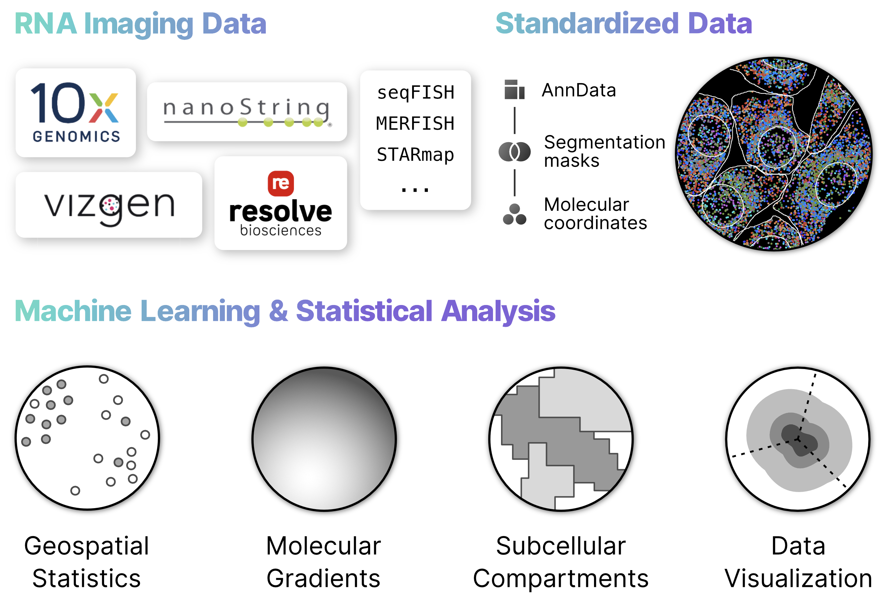

 

# Bento

Bento is a Python toolkit for performing subcellular analysis of spatial transcriptomics data. The package is part of the [Scverse ecosystem](https://scverse.org/packages/#ecosystem). Check out the [documentation](https://bento-tools.readthedocs.io/en/latest/) for installation instructions, tutorials, and API. For questions and troubleshooting, visit the `#bento` stream @ the [Scverse Zulip chat](https://scverse.zulip.com)!

Cite [our paper](https://doi.org/10.1101/2022.06.10.495510) if you use Bento in your work. Thanks!

---

